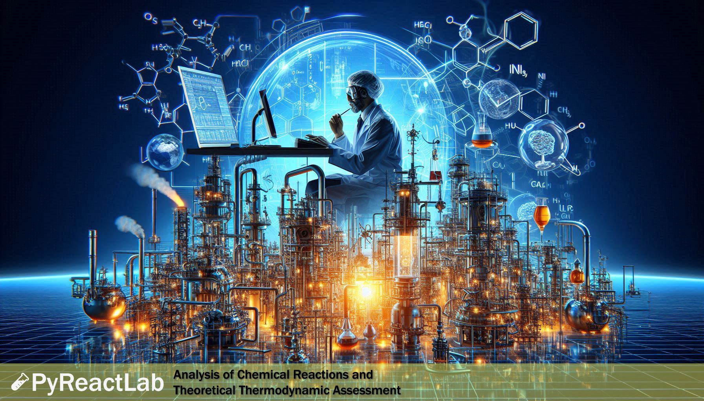

# PyReactLab



    

PyReactLab is an open-source Python package designed to analyze chemical reactions and theoretically assess their thermodynamic feasibility. It provides a robust and flexible framework for studying chemical reaction systems, making it an ideal tool for researchers, engineers, and scientists working in chemistry, chemical engineering, and related disciplines.

## 🔎 Introduction

This package is used to analyze different chemical reactions and to thermodynamically check their feasibility and behavior under various conditions. PyReactLab is aimed at supporting theoretical studies, reaction pathway assessments, and reaction property evaluations without involving reactor design. It is especially useful in early-stage research and educational applications where understanding reaction viability is essential.

## ✨ Key Features

- **🧪 Reaction Feasibility Check**: Determine whether a given chemical reaction is thermodynamically feasible under specified conditions.

- **🔥 Thermodynamic Property Evaluation**: Calculate reaction enthalpies, Gibbs free energy changes, and equilibrium constants.

- **🔄 Multi-Reaction System Support**: Analyze sets of reactions, including coupled and parallel reactions.

- **📊 Flexible Input**: Support for user-defined reactions, species properties, and thermodynamic data.

- **🛠 Integration Ready**: Easily integrate PyReactLab into larger computational workflows or couple it with other modeling tools.

## 🚀 Installation

You can install PyReactLab using pip:

```bash
pip install PyReactLab
```

For the latest development version, you can install directly from GitHub:

```bash
pip install git+https://github.com/sinagilassi/PyReactLab.git
```

## 🤝 Contributions

Contributions, issues, and feature requests are welcome!
Feel free to check the issues page or submit a pull request.

## 📝 License

This project is licensed under the MIT License. You are free to use, modify, and distribute this software in your own applications or projects. However, if you choose to use this app in another app or software, please ensure that my name, Sina Gilassi, remains credited as the original author. This includes retaining any references to the original repository or documentation where applicable. By doing so, you help acknowledge the effort and time invested in creating this project.

## ❓ FAQ

For any question, contact me on [LinkedIn](https://www.linkedin.com/in/sina-gilassi/)
